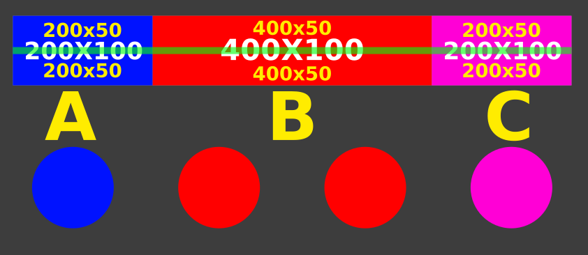

# Touch Bar Info Plugin for StreamController

Touch Bar Info is a feature-rich, full-canvas information display plugin built for StreamController on the Elgato Stream Deck +. It turns the 800x100 touch strip into a clean, customizable desktop dashboard for monitoring system performance, weather, time, and disk usage in real time.

> **Development Notice**: This plugin is currently under active, heavy development. Features, user controls, and rendering options are subject to ongoing updates and refinements.

---

## Touch Bar Layout & Sections

The 800x100 Touch Bar canvas is divided into three customizable modular sections: **Section A** (Left), **Section B** (Center), and **Section C** (Right).

Each section can be individually configured in two ways:
- **Full Slot (Single Widget)**: Spans the full height of the section for large, detailed displays (such as stacked date and time or full-height performance monitors).
- **Split Slot (Dual Sub-slots)**: Splits the section vertically into Top and Bottom sub-slots, allowing you to stack two independent widgets (such as Date on top and Weather on bottom).

---

## Available Widgets

### Stacked Date & Time
Displays your local date and time stacked across two lines. You can customize 12-hour or 24-hour clock formats, toggle seconds on or off, and choose from multiple date formatting styles (such as `Mon. Aug 11, 2026`, `08/11/2026`, or `11/08/2026`).

### Standalone Date
A clean, single-line date display formatted to your preference.

### Standalone Time
A high-visibility digital clock display with customizable typography, colors, and text outlines.

### Real-Time Weather
Provides live temperature, weather conditions, and location info retrieved automatically via Open-Meteo.

### World Clock
Displays a real-time clock for any global location with automatic time difference calculations:
- **Digital & Analog Clock Views**: Choose between a clean Digital text view or a round Analog clock face featuring animated hour, minute, and second hands.
- **Independent Seconds Toggle**: Easily toggle seconds on or off for the World Clock independently from the standalone Time widget.
- **Preset Cities**: Quick selection for major cities (London, New York, Los Angeles, Chicago, Paris, Berlin, Tokyo, Hong Kong, Sydney, Dubai, UTC).
- **Custom IANA Timezones**: Full support for any custom IANA timezone string (e.g. `America/New_York`, `Asia/Tokyo`, `Europe/Paris`) with custom city labels.
- **Time Offset & Day Indicator**: Displays time difference relative to local time along with day indicators (e.g., `+5h, Tomorrow` or `-3h`).
- **Full Typography & Styling**: Custom GTK font selector, font colors, and stroke outlines.

### CPU Monitor
Tracks live processor load percentage alongside an optional real-time utilization graph.

### RAM Usage Monitor
Monitors system memory consumption with three distinct display modes:
- **Percentage Mode**: Displays current RAM load percentage.
- **Used / Total GB Mode**: Displays a detailed breakdown of used and total system memory.
- **Live Graph Mode**: Shows a continuous real-time memory graph.

### Network Activity Monitor
Tracks live upload (TX) and download (RX) throughput. Offers toggles for KB/s or MB/s units and includes a live traffic graph.

### System Disk Usage Monitor
Monitors any physical partition or directory path (such as System Root `/`, Home `/home/user`, `/mnt/Games`, or `/mnt/Stuff`) selected using a native folder picker. Features three clean display modes:
- **Percentage Mode**: A stacked 2-line layout showing the disk name and used percentage (e.g. `Home (oscar)` / `17% Used`).
- **Used / Free GB Mode**: A stacked 2-line layout showing the disk name and exact capacity breakdown (e.g. `Games` / `337G Used / 107G Free`).
- **Live Bar Graph Mode**: A stacked layout featuring a header title on top and a sleek progress bar underneath showing available vs. used space.

---

## Key Features & Customization

- **Modular 3-Section Grid**: Flexible layout control across Sections A, B, and C with full-height or split sub-slot options.
- **World Clock Integration**: Monitor multiple global timezones with custom labels and relative time offsets (`+5h`, `Tomorrow`).
- **Custom Background Wallpapers**: Render custom PNG or JPG wallpaper images behind all Touch Bar widgets.
- **Typography & Styling Controls**: Customize fonts, text fill colors, and outline strokes for Date, Time, Weather, and World Clock widgets.
- **Multi-Input Support**: Works across Touchscreen (`sd-plus`), Dials, and Keys.

---

## Acknowledgments

This plugin and its documentation were developed with AI assistance (Google DeepMind Antigravity AI) for code architecture, performance optimization, and clear documentation.

---
